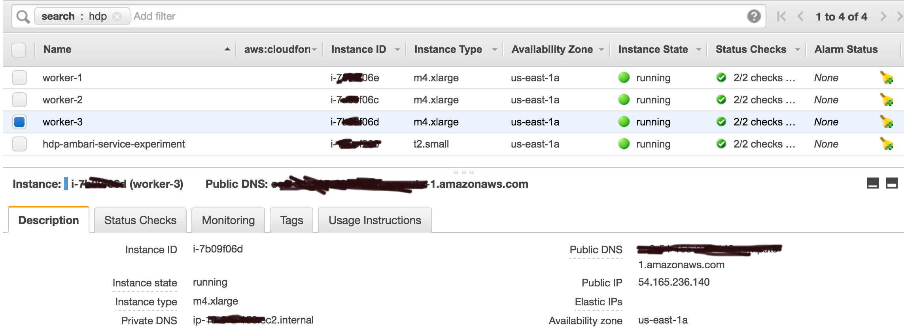

#Hortonworks Data Platform
Set up a 3-node (at least) cluster of the latest Hortonworks Data Platform via Ambari installation. You'll need to evaluate which components are actually required based on the rest of the exercise

AWS Instances

HDP cluster

Grafana Metrics

